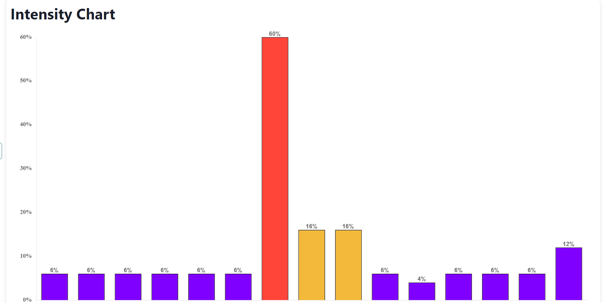
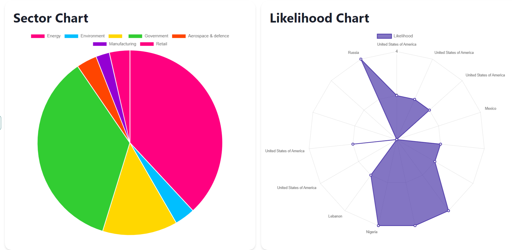

# Data Visualization Dashboard

Data Visualization Dashboard

## Screenshots

Here are some enticing snapshots showcasing the features and functionalities of our visualization dashboard:

## About
It is a visualization dashboard made using MERN stack.

## Tech Stacks

- MongoDB
- Express
- React
- Node.js
- Chart.js

## Installation

Installation Steps:

1. Clone this repository: `git clone https://github.com/shubhi-arora/BlackCoffer-project.git`
2. Navigate to the project directory: `cd BlackCoffer-Visualization-Dashboard`
3. Install dependencies:
   - Backend: `cd server && npm install`
   - Frontend: `cd client && npm install`
4. Run the application:
   - Backend: `cd server && npm start`
   - Frontend: `cd client && npm start`

Open your browser and access the dashboard at [http://localhost:3000](http://localhost:3000).

Feel free to explore the data visualizations and gain valuable insights from your data!
---

We hope you enjoy using the BlackCoffer Visualization Dashboard. If you have any questions or feedback, please don't hesitate to reach out. Happy analyzing!
